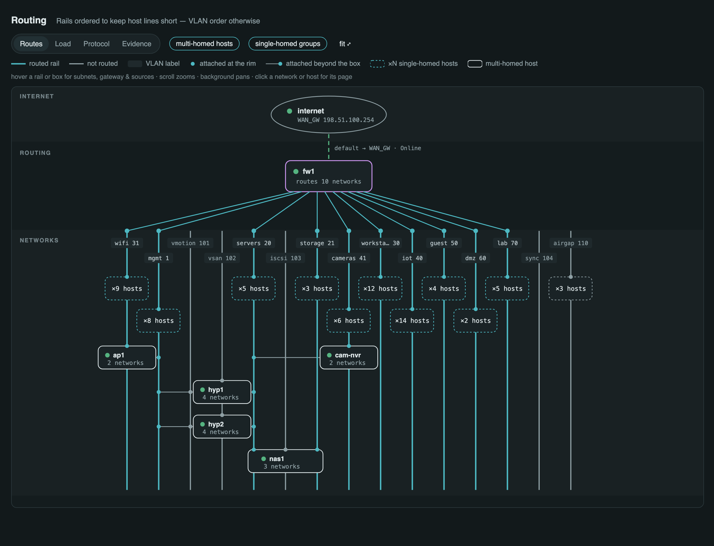

# ADR-0002 — The routed view: the logical network

*Status: accepted (2026-08-31) · Issue: [#17](https://github.com/dsmorgan/patchbay/issues/17)*

*The mock above is generated from [0002-routed-view-mock.html](0002-routed-view-mock.html)
against a 15-network model (10 routed, 5 not). It settled the visual design;
the shipped view was then polished against a real 8-network site render
(0.10.0), which drove the rail-participation filter and the internet-uplink
discovery below.*

## Context

The topology map answers "what is cabled to what." Nothing answers "what
network can reach what": which subnets exist, who routes between them, where
the default goes, and which hosts stand in more than one network. That is
the question an operator asks during segmentation work, firewall changes,
and "why can the IoT VLAN see the NAS" incidents — and it is the view
vSphere/ESXi gives per-host that patchbay should give for the whole site.

Everything needed is already in the model, collected per poll:

| fact | source |
|---|---|
| networks: CIDR, VLAN id, name | `subnets` (+ `vlans`) |
| who routes a network | a `firewall`/`router` device with an interface IP inside it |
| real next-hops, incl. cross-router | `routes` (OPNsense/pfSense route tables; BSD `B`/`R` flags = discard) |
| where the default goes | `routes` destination `0.0.0.0/0` / `::/0`, and `gateways` (WAN health) |
| a host's legs | every interface IP; a guest's via `vnic_vlans` + its addresses |
| how alive a network is | `endpoints` with an IP inside the CIDR |
| interface speeds (home-rail rule) | `interfaces.speed_bps` |

The hard problem named in #17 is **multi-homed hosts**: a NAS with legs in
two VLANs, a hypervisor with vmk interfaces in management and storage. Drawn
naively (a host node inside each network) the same box appears twice and the
lie is structural; drawn as a free-form node-and-edge graph, an attachment
has to be visually distinct from routing or every multi-homed NAS reads as
a router — and at 15 networks the hairball wins. The rails layout below is
the answer the design iterations converged on.

## Decision 1 — its own page, not a topology mode

`/routed` is a page beside `/topology` (rail: Network, under Topology), not
a fifth `view=` mode. ADR-0001's mode contract is that the graph JSON is
identical in every mode and only the painting changes; the routed view
breaks that on purpose — its subjects are *networks*, not every physical
box, and its geometry is a computed rails layout, not a force simulation.
Forcing it into `_topomap.html` would mean two graph schemas in one file
and a mode toggle that swaps both data and drawing — a second
implementation wearing the first one's clothes.

What it does share:

- **The URL-state pattern** (ADR-0001 Decision 1): state in the query
  string, only non-defaults serialized, sanitized rewrite on load, unknown
  params preserved.
- **The visual language**: same role icons and colors, same band treatment
  (Internet · Routing · Networks), same status-dot vocabulary, the same
  bordered frame with scroll-zoom, background-pan, and a fit button.
- **The toolbar grammar**: a segmented control for view modes, filter
  chips for boolean display toggles (#36), a horizontal legend below the
  frame whose items show per-mode.
- **The server-side builder pattern**: `build_routed_graph(conn, settings)`
  beside `build_topology_graph()`, so the snapshot can embed the routed view
  later without a reimplementation. v1 ships live-only; wiring it into the
  snapshot is a follow-up once the view has settled (the physical map
  remains the break-glass essential).

What it deliberately does **not** share: pins and dragging. The physical
map needs pins because force layout is nondeterministic; the routed layout
is computed and stable given the same inventory, so dragging could only
break it. If an ordering ever needs overriding, the escape hatch is a
declaration (`PATCHBAY_ROUTED_ORDER`, a comma-separated network list),
not per-node pins.

## Decision 2 — the rails layout

Networks are **vertical rails**; everything attached to a network is a box
on or connected to its rail. Three tiers from the first sketch survive:
Internet (cloud per WAN, with `gateways` health), Routing (routers and
firewalls; router↔router next-hop links and HA pairs render side-by-side
in this tier), Networks (the rails).

- **Router fan**: each routed network leaves its router on its own pin and
  runs as a straight angled line to a dot at the top of its rail, drawn in
  the rail's color (same interface = same color). Pins are ordered
  left-to-right with the rails so fan lines never cross each other. The
  default route is a dashed line from router to cloud carrying gateway
  health. Gateway addresses (`.1`) show on hover, not as labels. The
  **internet uplink rail** is discovered, not declared: the default
  route's exit interface resolves to its VLAN's rail (untagged membership
  first, else the rail holding the next-hop address); that rail draws in
  the ok color, the drop line names it ("via VLAN 299"), and hovering
  either lights both. A site whose WAN lands on a dedicated appliance
  port resolves to no rail and keeps the plain cloud-to-router drawing.
- **Routed vs unrouted is a class, not a color**: routed rails all take
  the accent; unrouted rails are muted grey with no fan line, and they
  intermix with routed rails wherever ordering puts them. A network no
  router claims reads as isolated by construction — the missing fan line
  *is* the badge. Discard routes (`B`/`R` flags) are excluded, same as
  /vlans. Per-network hue cycling was tried and rejected: ~10 hues is the
  legibility ceiling and interaction (hover-highlight) scales instead.
- **VLAN labels**: each rail carries a small square-cornered tag near its
  top dot — name + VLAN id, staggered on two rows, long names truncated
  with an ellipsis so tags never stretch. CIDRs live in the hover and on
  the per-network page.
- **A rail must participate**: a network draws when a router routes it,
  a host box has a leg on it, or single-homed hosts count against it.
  IPAM exports carry supernets, aggregates, and VLANs no device claims;
  those stay on `/vlans`, where documentation-vs-reality is the point.
  (Added after the real-site render: 16 rails collapsed to the 8 that
  exist.)
- **Rail ordering**: default is VLAN-number order left to right; the
  layout then reorders to minimize total attachment-line length (pull each
  multi-homed host's networks adjacent — a greedy pass is enough at
  homelab scale). Deterministic given the same inventory, so the layout
  only changes when attachments actually change.
- **Single-homed hosts** are never individual nodes: each network gets one
  dashed box ("×8 hosts"), the same size and shape as a host box — it
  stands in for N devices. Networks with no single-homed hosts get no box.
- **Multi-homed hosts** are solid boxes drawn **once**, parked on their
  *home rail*: the fastest interface's network, ties broken by highest
  VLAN id, then first-seen — chosen over "the mgmt interface" because
  mgmt legs share one VLAN and would stack every box on the same rail.
  The home rail may be an unrouted network (a NAS homed on iscsi); that
  is correct, not a special case.
- **Attachment marks, a three-part rule** (nas1 in the mock shows all
  three): a rail that meets the box edge gets a **dot on the rim**; a rail
  that crosses the box but isn't attached **passes underneath with no
  dot** (boxes are opaque; dot means attached, absence means geometry); a
  rail beyond the box's footprint gets a **thin line** from the box edge
  with a dot where it lands, passing under intermediate rails. Lines may
  exit both sides of a box. Interface names (`vmk0`, `eth1`) show on
  hover.

Hover is the detail layer throughout: a rail or box hover highlights
everything attached to it and dims the rest, and surfaces subnets, gateway
address, sources, and interface names. Clicking a network (tag or group
box) opens its page listing all attached hosts/interfaces; clicking a host
box opens the device page.

## Decision 3 — view modes and state

The segmented control mirrors the topology's, adapted to what this layer
can honestly claim:

- **Routes** (default) — the structural view above.
- **Load** — heat-tints only the router fan lines (the router's VLAN
  interfaces are the only edges here with counters), same palette and
  `now`/`24h peak` select as the topology; rails and attachments go muted.
- **Protocol** — this view *is* the VLAN view, so the third slot goes to
  address family: IPv4 / IPv6 / all, painting which rails and fan lines
  carry each family.
- **Evidence** — tints each rail by who reported the network (firewall
  config, hypervisor port groups, switch configs, IPAM), reusing the
  topology's reporter colors. A network only IPAM claims stands out
  immediately.

| param | values | default | meaning |
|---|---|---|---|
| `view` | `routes` \| `load` \| `protocol` \| `evidence` | `routes` | which mode paints |
| `proto` | `4` \| `6` \| `all` | `4` | address family (protocol mode's select) |
| `hosts` | `1` \| `0` | `1` | multi-homed host boxes |
| `groups` | `1` \| `0` | `1` | single-homed group boxes |
| `focus` | a node name | unset | highlight + center, as on /topology |

Every param follows ADR-0001's serialization rules. v1 ships Routes fully;
Load/Protocol/Evidence may land as follow-ups behind the same control.

## Decision 4 — what v1 does *not* do

- No firewall-rule awareness: a fan line means "routes", not "permits".
  Rule-aware reachability is a different feature with different data
  (config parsing) and belongs to its own issue if ever.
- No snapshot embedding yet (Decision 1).
- No NAT modeling: the default edge says "leaves here", nothing more.
- Multi-egress, HA router pairs, and multi-router sites are accounted for
  in the Routing tier's design but not exercised by the mock; they get
  test fixtures when the tier is built.

## Consequences

- A second map include (`_routedmap.html`) and a pure server-side module
  (`routed.py`): builder plus layout engine (ordering + row assignment so
  no two attachment lines share a y), so the layout unit-tests without a
  browser. The physical map is untouched.
- The demo network gains multi-homed hosts (a NAS with legs in three
  networks, hypervisors with storage legs) so the view's hardest cases —
  rim dots, pass-under, both-side lines — are visible on the public demo
  and in tests, not only on real sites.
- `/vlans` keeps its table; the routed view is its picture. Deep links go
  both ways (a VLAN tag links to `/vlans#v<vid>`, the vlans row gains a
  "show on routed map" link), same pattern the physical map set.
- The real-site render happened (0.10.0 on an 8-network site) and its
  findings — documentation-only rails, an undiscovered WAN, three pill
  heights in the shared toolbar grammar — are folded in above. Follow-up
  modes (Load / Protocol / Evidence) remain open behind Decision 3.
