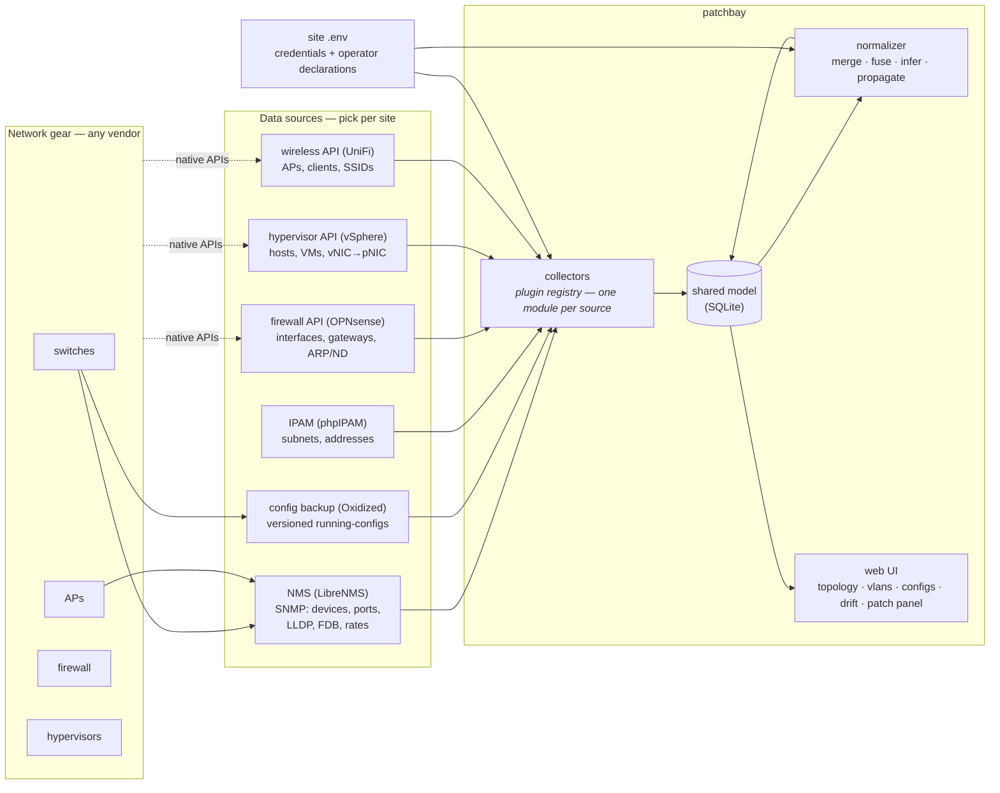
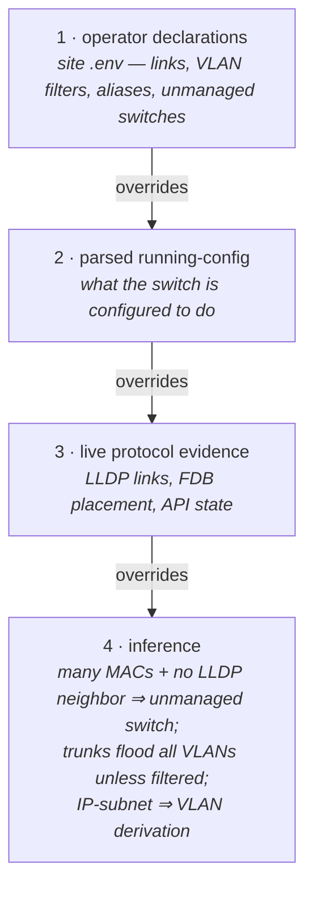

# patchbay — components & pluggability

*Companion to [architecture.md](architecture.md) (the spec & roadmap). This document
explains what the pieces are, what patchbay connects to, and how a site with different
gear — Cisco or UniFi switches, XCP-ng instead of vSphere, NetBox instead of phpIPAM —
plugs in.*

## The shape in one paragraph

patchbay does not talk to your switches directly. It sits **behind** a small set of
proven open-source tools that already speak to your gear — an SNMP-based NMS for live
state, Oxidized for config history — plus the native APIs of the boxes that expose far
more than SNMP does (firewall, hypervisor, wireless controller, IPAM). One **collector**
per source maps that source's view of the world into a single **shared model** in SQLite.
A **normalizer** then fuses the overlapping views into one truth (merging duplicate
identities, fusing half-links, inferring unmanaged switches, propagating VLANs), and the
web UI renders everything — topology, VLANs, load, drift, config timeline — from the
shared model alone. The UI never knows or cares which vendor produced a row.



The two boundaries that make this swappable:

1. **Gear → sources.** Vendor diversity is mostly absorbed *outside* patchbay. Any
   SNMP-capable switch — Cisco, UniFi, Netgear, Brocade/Ruckus, Aruba, MikroTik — appears
   through the NMS with **zero patchbay changes**. Oxidized ships models for 130+
   platforms, so config backup is likewise a source-side concern.
2. **Sources → shared model.** Everything downstream (normalizer, every page, snapshots,
   alerting) reads only the shared model. Swapping phpIPAM for NetBox means writing one
   collector; no view changes.

## The shared model

All collectors write to the same SQLite tables, upserting on natural keys (device name,
`device+interface`, MAC, IP) so multiple sources can each contribute their slice of the
same object:

| Table | What it holds | Typical writers |
|---|---|---|
| `devices` | name, role, vendor/model/OS, mgmt IP, status, `parent` (VM→host) | all |
| `interfaces` | per-port oper/admin status, speed, MAC, description, IP | NMS, firewall, hypervisor |
| `links` | A-side ↔ B-side port pairs, each with an evidence `source`: `lldp`, `vsphere-hint`, `fdb-uplink`, `fdb-inference`, or `declared` | NMS, normalizer, operator |
| `endpoints` | MAC-keyed things *on* the network: IP, hostname, port or SSID, VLAN | wireless, IPAM, firewall |
| `fdb` | raw MAC→port learning table | NMS |
| `subnets`, `vlans`, `device_vlans`, `port_vlans` | L3/L2 definitions and per-device / per-port VLAN membership (tagged/untagged), each row tagged with its evidence source | IPAM, NMS, config parser, normalizer |
| `port_roles` | ports whose job changes how their evidence reads — currently `monitor-dst` / `monitor-src` (mirror ports) | config parser |
| `vnic_vlans` | virtual NIC MAC → its port group VLAN, which the guest OS cannot see | hypervisor |
| `ipam_addresses` | the IPAM address book verbatim (for drift comparison) | IPAM |
| `gateways` | WAN/gateway state | firewall |
| `rate_history` | per-port in/out samples (feeds the 24 h-peak load view) | NMS |
| `raw_payloads` | cached raw API responses, for debugging collectors | all |

Rows carry their **evidence source**, and the normalizer resolves conflicts by
precedence — see below.

## The collector contract

A collector is one Python module implementing a three-member protocol and registering
itself ([collectors/\_\_init\_\_.py](../src/patchbay/collectors/__init__.py)):

```python
class Collector(Protocol):
    name: str
    def configured(self, settings: Settings) -> bool: ...
    def collect(self, settings: Settings, conn: sqlite3.Connection) -> str:
        """Run one poll cycle; returns a short human-readable summary."""
```

`available()` returns only collectors whose settings are present in the site `.env` —
**a deployment configures only the sources it has**. No source is mandatory; each page
degrades to whatever evidence exists (no IPAM → no drift report; no config backup → VLAN
membership falls back to SNMP + operator declarations).

Adding a source is therefore ([docs/collectors.md](collectors.md) is the full
authoring guide):

- **Out-of-tree** (no core changes): ship your own package exposing the
  collector through the `patchbay.collectors` entry-point group; it is
  discovered at startup. Your env vars are your own, read via `os.environ`.
- **In-tree**: new module in `src/patchbay/collectors/` with `name`,
  `configured()`, `collect()`; add its env vars to `config.py` /
  `.env.example`; add the module to the lazy-import list in
  `collectors/__init__.py`.

Either way, mapping the source's API into the shared-model tables *is* the
whole job. Existing collectors run 150–300 lines each; they are the best
templates.

## Source categories

patchbay thinks in **categories**, not products. Each category contributes a specific
kind of evidence; the reference implementation is the one this site runs.

| Category | Reference | Contributes | Known-compatible alternatives | Swap effort |
|---|---|---|---|---|
| **NMS / SNMP poller** | LibreNMS | device+port inventory, LLDP neighbors, FDB tables, traffic rates, VLAN tables | Observium, Zabbix, NetDisco — or a direct-SNMP collector | New collector mapping its API to `devices/interfaces/links/fdb/rate_history` |
| **Config backup** | Oxidized | config timeline + diffs (read via REST, never stored); parsed per-port VLAN truth | RANCID, `git`-based backup | New collector for the fetch side; parsers are reusable |
| **IPAM** | phpIPAM | `subnets`, `ipam_addresses` (the "documented" side of drift); optional UI object ids for deep links from drift findings | **NetBox**, Nautobot, a CSV even | New collector; the UI already says "IPAM", not "phpIPAM"; a collector that stores no object ids gets no deep links |
| **Firewall / router** | OPNsense | interface IPs (routed-VLAN evidence), gateways/WAN, DHCP leases, ARP/ND | pfSense (same API family), VyOS, RouterOS | New collector |
| **Hypervisor** | vSphere (pyVmomi) | hosts, VMs as `devices` with `parent`, guest IPs, vNIC→physical-NIC hints | **XCP-ng/XenServer (XAPI)**, Proxmox VE (REST), libvirt | New collector |
| **Wireless controller** | UniFi | APs, wireless clients as `endpoints` with SSID + VLAN | Omada, Ruckus Unleashed, standalone-AP SNMP | New collector |

### What about the switches themselves?

This is the question most people ask first, and the answer is the architecture's main
trick: **switch vendor support is not a patchbay concern at the live-state layer.** The
NMS abstracts SNMP/LLDP/FDB across vendors, and Oxidized abstracts config retrieval. A
site with Cisco Catalysts or UniFi switches needs no new patchbay code for topology,
load, status, or endpoint placement.

The one place vendor syntax reaches patchbay is **config parsing** — extracting per-port
VLAN membership (tagged/untagged/mode) from the backed-up running-config, which is the
highest-quality VLAN evidence available. Parsers live in
[collectors/oxidized.py](../src/patchbay/collectors/oxidized.py) and are dispatched by
the Oxidized model name:

- `parse_ironware` — Brocade/Ruckus FastIron style (`vlan N … tagged ethe x to y`)
- `parse_netgear` — Netgear M4300, both its dialects (`vlan participation` and
  `switchport mode/access/trunk`)

A new vendor is **one pure function**:

```
text in → ({vid: name}, [(port, vid, tagged)], [(port, role, detail)])
```

The third element is `port_roles` — ports whose job changes how their evidence
reads, currently mirror sources and destinations. Return an empty list if the
dialect has no such concept. Cisco IOS is an afternoon of work
(`switchport access vlan` and `trunk allowed vlan` are nearly identical to the
M4300's second dialect). A vendor with no parser breaks nothing; its ports fall
back to the next evidence tier.

All parsers normalize into **one port-mode language**: a port carrying any tagged VLAN is
a *trunk*; untagged-only is *access*. Vendor terms (general, dual-mode, hybrid) fold into
those two so every view speaks the same dialect.

## Evidence precedence & operator declarations

No single source sees everything, sources disagree, and some facts are invisible to every
protocol (a patch cable to a powered-off server generates no LLDP, no FDB entry, no
lease). patchbay resolves this with a strict precedence, most-trusted first:



The declarations are deliberately the top tier — the operator knows things no protocol
can learn. They live in the site `.env` (never in this repo) as plain strings:

| Variable | Declares |
|---|---|
| `PATCHBAY_ALIASES` | identity merges — a chassis serial or per-source name → canonical name |
| `PATCHBAY_LINKS` | cabling no protocol reveals (`sw1:port=host:nic`, or bare `sw1:port=name` for a host whose own port is unknowable) |
| `PATCHBAY_UNMANAGED` | ports known to feed a dumb switch, shown even when quiet |
| `PATCHBAY_VLAN_FILTER` | trunk ports restricted to a VLAN list (overrides the flood assumption) |
| `PATCHBAY_RELATED` | component pairs — a BMC/iDRAC/CIMC and the server it lives in |
| `PATCHBAY_WAN_NAME` / `PATCHBAY_WAN_PORT` | what the internet cloud is called and where it lands |
| `PATCHBAY_PANELS` | patch panels as `name:size=regex`; the capture group is the panel position a port description claims (default: one panel matching `[n]`) |
| `PATCHBAY_CAPACITY` | real service capacity where it's below the port speed (a 10G port carrying a 3G circuit); load math uses it and the map shows "10G (3G)" |

This tiering is also the graceful-degradation story: a site with only an NMS configured
gets a real topology from tiers 3–4 alone, and every additional source or declaration
sharpens it rather than being required.

## Worked examples

**XCP-ng instead of vSphere.** Write `collectors/xcpng.py` against XAPI (or the `xo-cli`
/ Xen Orchestra REST API): pools → hosts as `devices` (role `hypervisor`), VMs as
`devices` with `parent=<host>`, guest-tools IPs → `mgmt_ip`, PIFs → `interfaces` (their
MACs let LLDP/FDB tie host NICs to switch ports). Register it, add `XCPNG_URL/USER/PASS`
to config. The topology, VM containment, and VLAN propagation views work unchanged
because they only read `devices.parent` and `interfaces`.

**NetBox instead of phpIPAM.** Write `collectors/netbox.py`: `/api/ipam/prefixes/` →
`subnets` (with VLAN bindings), `/api/ipam/ip-addresses/` → `ipam_addresses` (map
NetBox's status field to patchbay's `used/dhcp/reserved/offline` states). The drift
report — documented-vs-observed, decommission candidates — is entirely
source-agnostic.

**A Cisco switch appears on site.** Add it to the NMS and to Oxidized (`ios` model) —
topology, load, FDB, and config history all work with no code change. For per-port VLAN
truth, add `parse_ios()` to the oxidized collector and dispatch on `model == "ios"`.

## Deliberate boundaries

- **Read-only.** Collectors only ever GET; write operations are a distant, separately
  credentialed phase (see the roadmap).
- **Config text is never persisted.** The oxidized collector parses configs in memory
  and stores only the derived VLAN facts; secrets in configs never touch the DB.
- **No collector talks to another.** Correlation happens in the normalizer, against the
  shared model — so collectors stay independent, and one source being down never breaks
  the others.
- **The UI reads only the shared model.** Which is why every page keeps working, at
  reduced fidelity, whatever subset of sources a site actually runs.
